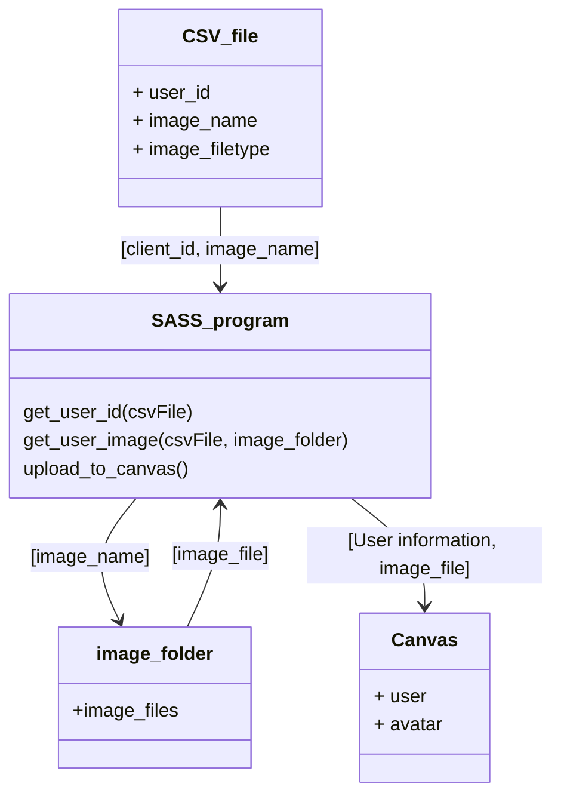

# Canvas Avatar Updater ()

This program will allow for the large scale updating of user avatars in Canvas. 
Initially it will use a known list of students and their pre-populated images to 
update the canvas avatars. 
> Note This is a redesign of: https://github.com/kat3su/CanvasMassAvatarUploadSISID

The operation of this program is explained and detailed within this document.
This is outlined in the following segments:

### Contents
1. CSV_FILE
2. Settings
3. Images
4. Operation

+++++++++++++++++++++++++++++++++++++++++++++++++++++++++++++++++ 

## CSV_File
This is the file which is the source of all user (student) details, necessary for the updating
of the avatars. The file is comprised of 3 columns; the first contains the user's ID number, the second contains the image name for their avatar, and the third contains the type of file which the image is encoded in.

The structure is as follows:

| user_id | image_name | image_filetype |
|---------|------------|----------------|
| 104456  | 104456.jpg | jpeg           |
| 65669   | 65669.jpg  | jpeg           |

> NOTE: Example data included for clarity, actual data not included

The CSV file needs to be populated with all the details for the operation before the program is run. Any client which is not included in the CSV file will not have their Avatar updated. 
The program's structure for working with the CSV file is as follows:


+++++++++++++++++++++++++++++++++++++++++++++++++++++++++++++++++
## Settings 

To remove the need to edit the script. A settings file is used. This file is encoded in Yaml format. This allows for simple use of 'tags' which denote the name of the setting with the value being assigned.  

> Important   
> As the YAML parser is an external library, you will need to ensure that you have the external library installed.
``` YAML
---
# Outline the directories to be used by the application
Directories:
  working_path: "./"                            # The root directory of the application
  csv_directory: "CSV_data/"                    # The Directory (from root) of the CSV data
  images_directory: "Images/"                   # The Directory (from root) of the user images

# Canvas specific information required for authentication
Canvas_data:
  domain: ""                                    # Local canvas implementation domain EG: <org>.instructure.com 
  access_token: ""                              # Access token to authenticate with canvas

# Specific files used for the application
File_names:
  csv_filename: "data.csv"                      # Name of the csv file within the csv directory
  log_filename: "Log.txt"                       # Name of the log file within the root directory
```

+++++++++++++++++++++++++++++++++++++++++++++++++++++++++++++++++

## Images
Canvas supports only a small subset of images. 

- PNG
- JPG
- GIF

### Images folder
The images folder is used to store the images for the application. This folder can be located in any directory. To change the programs location for this folder, edit the image folder path in the settings.json file. 

> Important
> Canvas recommends that your image file be as small as possible for the image being uploaded. Use compression where possible. 

+++++++++++++++++++++++++++++++++++++++++++++++++++++++++++++++++

# Relevant Canvas api points

The canvas API has several relevant points which must be considered when using this app. These are discussed in the subsequent sections. 

The relevant sections which are used in this application are as follows:
- Users (Section Heading)
- Avatars (Section Heading)

### Users (Section Heading)

The users section heading is for accessing the information on the current users of the canvas instance. For a given domain, the users can be accessed and their information can be collected or altered. 

- URL:
    - https://canvas.instructure.com/doc/api/users.html

- User object
``` json
// A Canvas user, e.g. a student, teacher, administrator, observer, etc.
{
  // The ID of the user.
  "id": 2,
  // The name of the user.
  "name": "Sheldon Cooper",
  // The name of the user that is should be used for sorting groups of users, such
  // as in the gradebook.
  "sortable_name": "Cooper, Sheldon",
  // The last name of the user.
  "last_name": "Cooper",
  // The first name of the user.
  "first_name": "Sheldon",
  // A short name the user has selected, for use in conversations or other less
  // formal places through the site.
  "short_name": "Shelly",
  // The SIS ID associated with the user.  This field is only included if the user
  // came from a SIS import and has permissions to view SIS information.
  "sis_user_id": "SHEL93921",
  // The id of the SIS import.  This field is only included if the user came from
  // a SIS import and has permissions to manage SIS information.
  "sis_import_id": 18,
  // The integration_id associated with the user.  This field is only included if
  // the user came from a SIS import and has permissions to view SIS information.
  "integration_id": "ABC59802",
  // The unique login id for the user.  This is what the user uses to log in to
  // Canvas.
  "login_id": "sheldon@caltech.example.com",
  // If avatars are enabled, this field will be included and contain a url to
  // retrieve the user's avatar.
  "avatar_url": "https://en.gravatar.com/avatar/d8cb8c8cd40ddf0cd05241443a591868?s=80&r=g",
  // Optional: If avatars are enabled and caller is admin, this field can be
  // requested and will contain the current state of the user's avatar.
  "avatar_state": "approved",
  // Optional: This field can be requested with certain API calls, and will return
  // a list of the users active enrollments. See the List enrollments API for more
  // details about the format of these records.
  "enrollments": null,
  // Optional: This field can be requested with certain API calls, and will return
  // the users primary email address.
  "email": "sheldon@caltech.example.com",
  // Optional: This field can be requested with certain API calls, and will return
  // the users locale in RFC 5646 format.
  "locale": "tlh",
  // Optional: This field is only returned in certain API calls, and will return a
  // timestamp representing the last time the user logged in to canvas.
  "last_login": "2012-05-30T17:45:25Z",
  // Optional: This field is only returned in certain API calls, and will return
  // the IANA time zone name of the user's preferred timezone.
  "time_zone": "America/Denver",
  // Optional: The user's bio.
  "bio": "I like the Muppets."
}
```

From this object. The app is most interested in the User's Canvas ID. This is then used as the lynch pin to interact with this User's profile. 

### Avatars (Section Heading) 

The avatars object contains the information about the User's current Avatar. There are stock avatars which are provided by Canvas. So if the user has not changed their avatar, a stock avatar photo will be present.   
Even if a user has changed their avatar. The software will upload, or replace a file of the same name, with the file provided in the individuals folder.

- URL
    - 

- Avatar object
``` Json
// Possible avatar for a user.
{
  // ['gravatar'|'attachment'|'no_pic'] The type of avatar record, for
  // categorization purposes.
  "type": "gravatar",
  // The url of the avatar
  "url": "https://secure.gravatar.com/avatar/2284...",
  // A unique representation of the avatar record which can be used to set the
  // avatar with the user update endpoint. Note: this is an internal
  // representation and is subject to change without notice. It should be consumed
  // with this api endpoint and used in the user update endpoint, and should not
  // be constructed by the client.
  "token": "<opaque_token>",
  // A textual description of the avatar record.
  "display_name": "user, sample",
  // ['attachment' type only] the internal id of the attachment
  "id": 12,
  // ['attachment' type only] the content-type of the attachment.
  "content-type": "image/jpeg",
  // ['attachment' type only] the filename of the attachment
  "filename": "profile.jpg",
  // ['attachment' type only] the size of the attachment
  "size": 32649
}
```
This object is the most important in the updating element of the program. It contains all the parameters which will be set by the program. This object can be used to verify that an object has been appropriately updated. The following elements serve a purpose in the program:

- Tags:
    - **token** : The Individual token for each image. This should be unique to the image.
    - **content-type**: This is the file type of the image. Canvas auto-detects this or it is set by the program.
    - **filename**: This is the student's SIS id from the csv. This will be set by the program, if this is not set to the student's ID then the an internal error occurred, or a user has changed their profile picture.