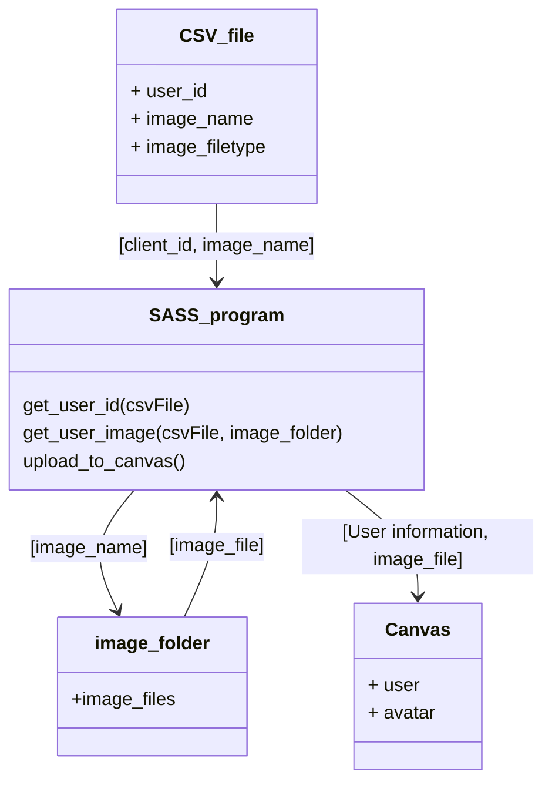

# Canvas Avatar Updater

This program will allow for the large scale updating of user avatars in Canvas. 
Initally it will use a known list of students and their pre-populated images to 
update the canvas avatars. 
> Note This is a redesign of: https://github.com/kat3su/CanvasMassAvatarUploadSISID

The opertion of this program is explained and detailed within this document.
This is outlined in the following segments:

### Contents
1. CSV_FILE
2. Images
3. Operation

## CSV_File
This is the file which is the source of all user (student) details, neccesary for the updating
of the avatars. The file is comprised of 3 columns; the first contains the user's ID number, the second contains the image name for their avatar, and the third contains the type of file which the image is encoded in.

The structure is as follows:

| user_id | image_name | image_filetype |
|---------|------------|----------------|
| 104456  | 104456.jpg | jpeg           |
| 65669   | 65669.jpg  | jpeg           |

> NOTE: Example data included for clarity, actual data not included

The CSV file needs to be populated with all the details for the operation before the program is run. Any client which is not included in the CSV file will not have their Avatar updated. 
The program's structure for working with the CSV file is as follows:

