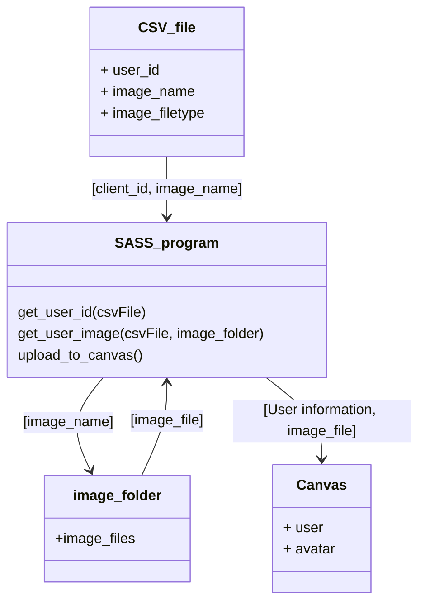

# Canvas Avatar Updater

This program will allow for the large scale updating of user avatars in Canvas. 
Initally it will use a known list of students and their pre-populated images to 
update the canvas avatars. 
> Note This is a redesign of: https://github.com/kat3su/CanvasMassAvatarUploadSISID

The opertion of this program is explained and detailed within this document.
This is outlined in the following segments:

### Contents
1. CSV_FILE
2. Images
3. Operation

## CSV_File
This is the file which is the source of all user (student) details, neccesary for the updating
of the avatars. The file is comprised of 3 columns; the first contains the user's ID number, the second contains the image name for their avatar, and the third contains the type of file which the image is encoded in.

The structure is as follows:

| user_id | image_name | image_filetype |
|---------|------------|----------------|
| 104456  | 104456.jpg | jpeg           |
| 65669   | 65669.jpg  | jpeg           |

> NOTE: Example data included for clarity, actual data not included

The CSV file needs to be populated with all the details for the operation before the program is run. Any client which is not included in the CSV file will not have their Avatar updated. 
The program's structure for working with the CSV file is as follows:


## Settings

To remove the need to edit the script. A settings file is used. This file is encoded in the Json format. This allows for simple use of 'tags' which denote the name of the setting with the value being assigned.

#### Default state
The default state for the settings file as found in this repository is as follows:
``` json
{
    "working_path" : "./",
    "access_token" : "",
    "domain" : "kings.instructure.com",
    "csv_filename" : "CSV_data/data.csv",
    "images_path" : "Images/",
    "log_filename" : "Log.txt"
}

```
Each of the 'tags' represents a setting in the program. Their values are indicated on the right of the ":". Each setting is required for the program to operate and their purpose is as follows:

- Working_path:
    - Is the working directory of the script. This is used to make elements of the program aware of the programs home directory. 
- access_token:
    - This token is the admin access token for canvas. Without this token, the program will not be able to authenticate with canvas. You may need to speak with a relevant admin to get this token.
- domain:
    - The domain is your institution's domain. This allows for the API to target the specific instance of canvas running for your institution.
- images_path:
    - This is the path to the folder for the images. This, by default, is contained in the home directory of the application.
- log_filename:
    - The name of the log file. This should be logging the internal actions of the script. If any errors are occuring they will be logged here. 


## Images
Canvas supports only a small subset of image types for avatars. The safest option for images is the Jpeg type. This program is able to handle different types of files, however, it is recomended that all thes files are saved or converted to jpeg before they are added to the images folder.

### Images folder
The images folder is used to store the images for the application. This folder can be located in any directory. To change the programs location for this folder, edit the image folder path in the settings.json file. 

# Relevant Canvas api points

The canvas API has several relevant points which must be considered when using this app. These are discussed in the subsequent sections. 

The relevant sections which are used in this application are as follows:
- Users (Section Heading)

### Users (Section Heading)

The users section heading is for accessing the information on the current users of the canvas instance. For a givent domain, the users can be accessed and their information can be collected or altered. The relevant user's section within this API are:

- User object
- Avatar Object 